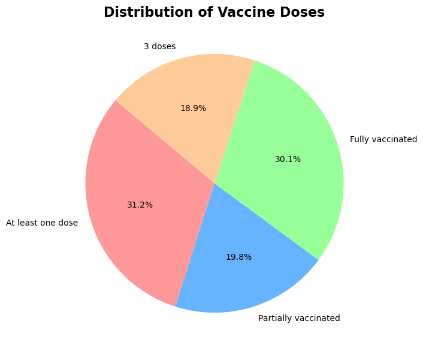
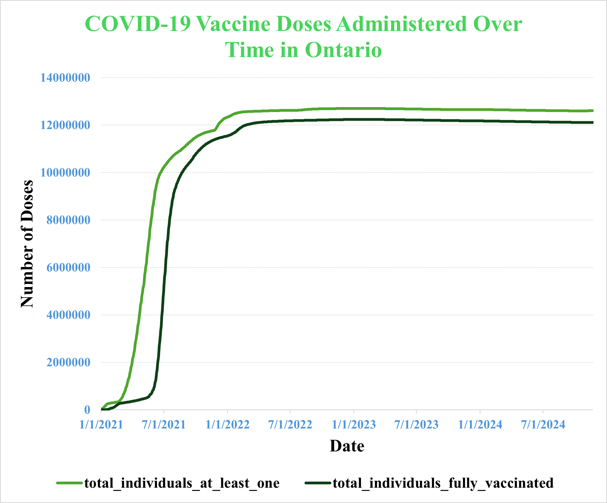

# Data Visualization

## Assignment 3: Final Project

### Requirements:
- We will finish this class by giving you the chance to use what you have learned in a practical context, by creating data visualizations from raw data. 
- Choose a dataset of interest from the [City of Toronto’s Open Data Portal](https://www.toronto.ca/city-government/data-research-maps/open-data/) or [Ontario’s Open Data Catalogue](https://data.ontario.ca/). 
- Using Python and one other data visualization software (Excel or free alternative, Tableau Public, any other tool you prefer), create two distinct visualizations from your dataset of choice.  
- For each visualization, describe and justify: 
📊 **Visualization 1: Pie Chart (Python with Matplotlib)**

[codes](visualization_1_python.ipynb)

    > What software did you use to create your data visualization?

✅ **Software used:**  For the first visualization, I used Python with the Matplotlib library. 

    > Who is your intended audience? 

👥 **Intended audience:** The intended audience includes public health officials, policymakers, and people interested in understanding the distribution of COVID-19 vaccine doses in Ontario, Canada.

    > What information or message are you trying to convey with your visualization? 

💡 **Information/message conveyed:**  The pie chart visualizes the proportion of individuals at different vaccination stages:

- At least one dose
- Partially vaccinated
- Fully vaccinated
- Third dose 

The goal is to highlight the distribution of vaccine coverage and emphasize the share of individuals who have received full vaccination versus only partial coverage.
    
    > What design principles (substantive, perceptual, aesthetic) did you consider when making your visualization? How did you apply these principles? With what elements of your plots? 

🎨 **Design principles considered:**

**1. Substantive principle:** The chart uses actual vaccination data from Ontario to accurately reflect the distribution.

**2. Perceptual principle:** I chose **distinct colors** for each category to make the chart easily interpretable. The use of percentages provides a clear view of the proportions.

**3. Aesthetic principle:** The pie chart uses **clean, labeled segments** with an appropriate color scheme to ensure visual appeal and readability.
    
    > How did you ensure that your data visualizations are reproducible? If the tool you used to make your data visualization is not reproducible, how will this impact your data visualization? 
    
🔁 **Reproducibility:**
Since the chart was created in Python, it is fully reproducible by running the same code on any system with the required libraries installed. The code ensures consistency, allowing others to replicate or modify the visualization.
    
    > How did you ensure that your data visualization is accessible?  

🌍 **Accessibility:**

To enhance accessibility, the chart uses clear labels and color differentiation. However, it could be improved by including a legend with textual descriptions for color-blind users or using patterns instead of colors.

    > Who are the individuals and communities who might be impacted by your visualization?  

👥 **Impacted individuals and communities:**

Public health experts can use this visualization to track vaccination coverage and identify gaps. General peope can better understand vaccine distribution and coverage rates.
    
    > How did you choose which features of your chosen dataset to include or exclude from your visualization? 

🔎 **Feature selection:**

I included the four key vaccination stages (at least one dose, partially vaccinated, fully vaccinated, and third doses) as they represent the most meaningful vaccine coverage categories. I excluded columns like daily doses administered, which are more relevant for time-series visualizations rather than pie charts.
    
    > What ‘underwater labour’ contributed to your final data visualization product?

💡 **Underwater labor:**

**Data cleaning:** Handling NaN values in the dataset.

**Data aggregation:** Selecting the maximum values to represent the latest vaccine coverage metrics.

**Visualization:** Designing and refining the color scheme, labels, and layout.

📈 **Visualization 2: Line Chart (Excel)**

[excell files](datasets/vaccine_doses.xlsx)

> What software did you use to create your data visualization?

✅ **Software used:**

For this visualization, I used Excel, a widely accessible spreadsheet and data visualization tool. 

> Who is your intended audience?

👥 **Intended audience:**

The intended audience includes public health officials, policymakers, data analysts, and the general public.

- Health officials can use this visualization to track vaccine coverage over time.
- General public may find it helpful to understand how the vaccine rollout progressed.
- Researchers and journalists can reference the visualization when reporting on vaccination trends.

> What information or message are you trying to convey with your visualization?

💡 **Information/message conveyed:**

The line chart shows the cumulative number of individuals vaccinated over time in Ontario, Canada. It highlights two key metrics:

- Individuals with at least one dose (green line)
- Fully vaccinated individuals (dark green line)

The chart demonstrates:
- The rapid increase in vaccinations in early 2021, corresponding to the initial rollout.
- The flattening trend later on, indicating that most eligible individuals had been vaccinated.

> What design principles (substantive, perceptual, aesthetic) did you consider when making your visualization? How did you apply these principles? With what elements of your plots?

🎨 **Design principles considered:**

**Substantive principle:**
The visualization uses real-world vaccination data to accurately represent the trend over time.

**Perceptual principle:**
The color differentiation between the two lines allows for easy distinction. Grid lines and axis labels make the chart more readable.

**Aesthetic principle:**
The lines are clearly labeled, and the date labels are tilted for better readability.
The chart uses contrasting colors (light green vs. dark green) to differentiate the two vaccination groups.

> How did you ensure that your data visualizations are reproducible? If the tool you used to make your data visualization is not reproducible, how will this impact your data visualization?

🔁 **Reproducibility:**

Since the chart was created in Excel, it is partially reproducible.
To ensure reproducibility, the Excel file with the source data is provided [here](datasets/vaccine_doses.xlsx) so others can recreate or modify the chart.

> How did you ensure that your data visualization is accessible?

🌍 **Accessibility:**
To improve accessibility:

The use of color-coded lines makes it easy to distinguish the vaccination stages.
The axis labels and legend provide clear context.

> Who are the individuals and communities who might be impacted by your visualization?

👥 **Impacted individuals and communities:**

-  **Public health experts** can use this visualization to monitor and communicate vaccination progress.
- **General public** can better understand the scale of the vaccine campaign.
-  **Journalists and researchers** may reference it to report on vaccination coverage.
- **Policymakers** can use the data to assess vaccination efforts and plan for future health campaigns.

> How did you choose which features of your chosen dataset to include or exclude from your visualization?

🔎 **Feature selection:**

I included the cumulative vaccination metrics (at least one dose and fully vaccinated), which effectively illustrate the overall vaccine coverage.
I excluded other metrics, such as daily doses administered, as they may create noise in a long-term trend visualization.

>  What ‘underwater labour’ contributed to your final data visualization product?

💡 **Underwater labor:**

**Data preparation:** Cleaning and structuring the dataset in Excel.

**Chart creation:** Selecting the appropriate chart type, formatting the lines, and applying colors.

**Labeling:** Adding clear axis labels and ensuring readability with date formatting.

✅ **Final thoughts:**

The line chart effectively communicates the progress of COVID-19 vaccinations in Ontario over time. It highlights the rapid rollout in early 2021 and the eventual plateau, offering valuable insights for public health officials and the general public.

- This assignment is intentionally open-ended - you are free to create static or dynamic data visualizations, maps, or whatever form of data visualization you think best communicates your information to your audience of choice! 
- Total word count should not exceed **(as a maximum) 1000 words** 
 
### Why am I doing this assignment?:  
- This ongoing assignment ensures active participation in the course, and assesses the learning outcomes: 
* Create and customize data visualizations from start to finish in Python
* Apply general design principles to create accessible and equitable data visualizations
* Use data visualization to tell a story  
- This would be a great project to include in your GitHub Portfolio – put in the effort to make it something worthy of showing prospective employers!

### Rubric:

| Component         | Scoring  | Requirement                                                                 |
|-------------------|----------|-----------------------------------------------------------------------------|
| Data Visualizations | Complete/Incomplete | - Data visualizations are distinct from each other - Data visualizations are clearly identified - Different sources/rationales (text with two images of data, if visualizations are labeled) - High-quality visuals (high resolution and clear data) - Data visualizations follow best practices of accessibility |
| Written Explanations | Complete/Incomplete | - All questions from assignment description are answered for each visualization - Explanations are supported by course content or scholarly sources, where needed |
| Code              | Complete/Incomplete | - All code is included as an appendix with your final submissions - Code is clearly commented and reproducible |

## Submission Information

🚨 **Please review our [Assignment Submission Guide](https://github.com/UofT-DSI/onboarding/blob/main/onboarding_documents/submissions.md)** 🚨 for detailed instructions on how to format, branch, and submit your work. Following these guidelines is crucial for your submissions to be evaluated correctly.

### Submission Parameters:
* Submission Due Date: `23:59 - 09/03/2025`
* The branch name for your repo should be: `assignment-4`
* What to submit for this assignment:
    * A folder/directory containing:
        * This file (assignment_3.md)
        * Two data visualizations 
        * Two markdown files for each both visualizations with their written descriptions.
        * Link to your dataset of choice.
        * Complete and commented code as an appendix (for your visualization made with Python, and for the other, if relevant) 
* What the pull request link should look like for this assignment: `https://github.com/<your_github_username>/visualization/pull/<pr_id>`
    * Open a private window in your browser. Copy and paste the link to your pull request into the address bar. Make sure you can see your pull request properly. This helps the technical facilitator and learning support staff review your submission easily.

Checklist:
- [ ] Create a branch called `assignment-3`.
- [ ] Ensure that the repository is public.
- [ ] Review [the PR description guidelines](https://github.com/UofT-DSI/onboarding/blob/main/onboarding_documents/submissions.md#guidelines-for-pull-request-descriptions) and adhere to them.
- [ ] Verify that the link is accessible in a private browser window.

If you encounter any difficulties or have questions, please don't hesitate to reach out to our team via our Slack. Our Technical Facilitators and Learning Support staff are here to help you navigate any challenges.
